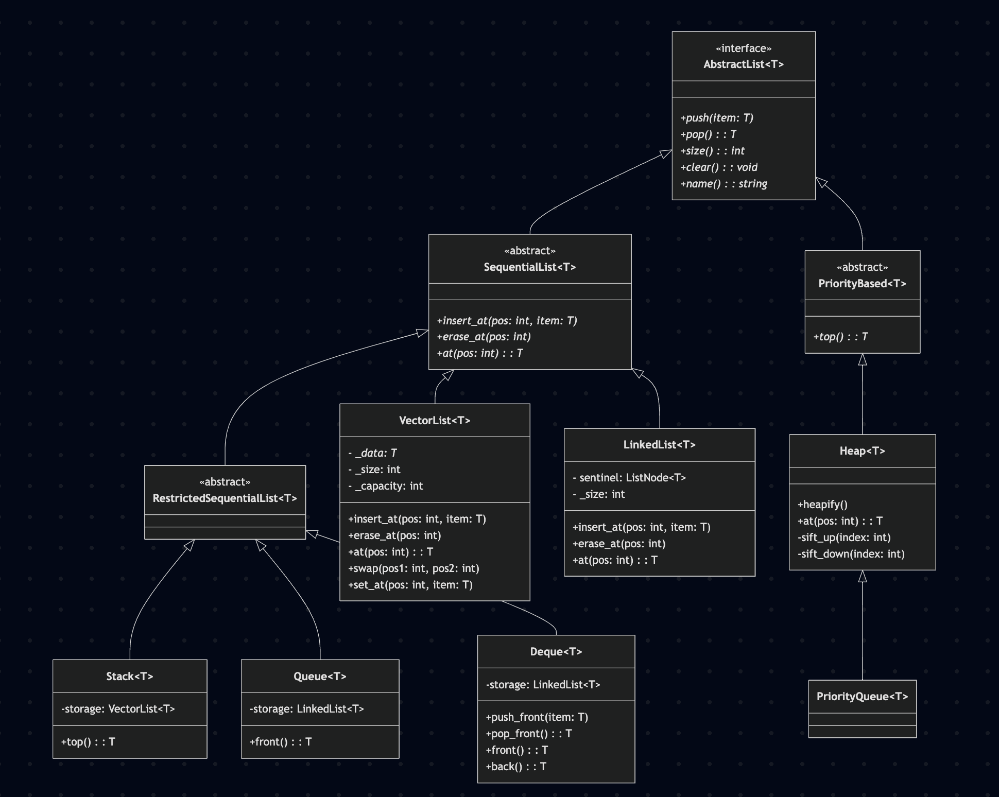

# Data Abstraction and Object Orientation- List Container

This project is a from-scratch C++ implementation of a hierarchical system of list-like containers. Extensive documentation of the project follows.

## Project Structure

```
.
├── Makefile
├── common
│   └── list_err.h
├── containers
│   ├── AbstractList.h
│   ├── Deque.h
│   ├── Deque.cpp
│   ├── Heap.h
│   ├── Heap.cpp
│   ├── LinkedList.h
│   ├── LinkedList.cpp
│   ├── ListNode.h
│   ├── PriorityBased.h
│   ├── PriorityQueue.h
│   ├── PriorityQueue.cpp
│   ├── Queue.h
│   ├── Queue.cpp
│   ├── RestrictedSequentialList.h
│   ├── SequentialList.h
│   ├── Stack.h
│   ├── Stack.cpp
│   ├── VectorList.h
│   └── VectorList.cpp
├── main.cpp
└── tests
    ├── test_deque.cpp
    ├── test_heap.cpp
    ├── test_linkedlist.cpp
    ├── test_priorityqueue.cpp
    ├── test_queue.cpp
    ├── test_stack.cpp
    └── test_vectorlist.cpp
```

## Class Hierarchy



The project is designed as a tree of classes that inherit from one another. This allows for significant code reuse and a strong, type-safe structure.

-   `AbstractList<T>`: This is the root of the hierarchy. It's a pure abstract class (an "interface") that defines the five fundamental methods (`push`, `pop`, `size`, `clear`, `name`) that every container in this project must have.

-   `SequentialList<T>`: This abstract class inherits from `AbstractList` and represents containers that are accessed by an integer index. It adds the abstract methods `insert_at`, `erase_at`, and `at`.

    -   `VectorList<T>` and `LinkedList<T>`: These are the two main concrete implementations of `SequentialList`. They provide the full functionality of a sequential list, one using a from-scratch dynamic array and the other using from-scratch nodes and pointers.

    -   `RestrictedSequentialList<T>`: This is an abstract "marker" class. Its purpose is to group the adapter classes (`Stack`, `Queue`, `Deque`) that have a sequential nature but do not allow arbitrary access with `insert_at` or `at`.

        -   `Stack<T>`, `Queue<T>`, `Deque<T>`: These are adapter classes. They contain a more fundamental container (`VectorList` or `LinkedList`) and provide a simpler, more specific interface (LIFO for Stack, FIFO for Queue, etc.).

-   `PriorityBased<T>`: This abstract class inherits from `AbstractList` and is for containers where elements are accessed by priority, not position. It adds the abstract `top` method.

    -   `Heap<T>`: This is the concrete implementation of `PriorityBased`. It uses a `VectorList` for storage and implements the heap algorithms to ensure the highest-priority item is always at the top. It also exposes methods like `heapify` for advanced use.

    -   `PriorityQueue<T>`: This class inherits directly from `Heap`. Its purpose is to provide a simpler, safer interface for the common use case of a priority queue. It reuses the entire implementation of `Heap` but hides advanced methods like `heapify` and `at` that don't belong to a strict priority queue.

## API Reference

This section defines the public Application Programming Interface (API) for each class and outlines the "promise" for each method—the behavior guaranteed to the user.

### `AbstractList<T>` (Interface)
This is the root of the hierarchy, defining the absolute minimum functionality for any container.

`virtual void push(T item) = 0;`
**Promise:** Adds a single item to the container. The location (front, back) depends on the concrete class.

`virtual T pop() = 0;`
**Promise:** Removes and returns a single item from the container. The location depends on the concrete class. Will throw a `list_err` if empty.

`virtual int size() = 0;`
**Promise:** Returns the total number of items currently in the container.

`virtual void clear() = 0;`
**Promise:** Removes all items from the container.

`virtual const char* name() = 0;`
**Promise:** Returns the name of the container type (e.g., "Stack", "Queue").

---

### Concrete Sequential Containers

#### `VectorList<T>`
A sequential container implemented with a from-scratch dynamic array.

`void insert_at(int pos, T item);`
**Promise:** Inserts an item at a specific integer position.

`void erase_at(int pos);`
**Promise:** Removes the item at a specific integer position.

`T at(int pos);`
**Promise:** Returns the item at a specific integer position without removing it.

`void swap(int pos1, int pos2);`
**Promise:** Efficiently swaps the elements at two given positions.

`void set_at(int pos, T item);`
**Promise:** Overwrites the element at a specific position with a new item.

#### `LinkedList<T>`
A sequential container implemented from scratch with nodes and pointers.

`void insert_at(int pos, T item);`
**Promise:** Inserts an item at a specific integer position.

`void erase_at(int pos);`
**Promise:** Removes the item at a specific integer position.

`T at(int pos);`
**Promise:** Returns the item at a specific integer position without removing it.

---

### Concrete Restricted Sequential Containers

#### `Stack<T>`
A Last-In, First-Out (LIFO) container. Its `push` and `pop` methods operate on the "top" of the stack.

`T top();`
**Promise:** Returns the item at the top of the stack without removing it.

#### `Queue<T>`
A First-In, First-Out (FIFO) container. Its `push` and `pop` methods operate on the "back" and "front" respectively.

`T front();`
**Promise:** Returns the item at the front of the queue without removing it.

#### `Deque<T>`
A double-ended queue. The default `push` adds to the back and `pop` removes from the back.

`void push_front(T item);`
**Promise:** Adds an item to the "front."

`T pop_front();`
**Promise:** Removes and returns an item from the "front."

`T front();`
**Promise:** Returns the item at the front without removing it.

`T back();`
**Promise:** Returns the item at the back without removing it.

---

### Concrete Priority-Based Containers

#### `Heap<T>`
A container that stores items in a min-heap structure, implemented with a `VectorList`.

`void heapify();`
**Promise:** Rearranges an existing collection of items into a valid heap structure in-place.

`T at(int pos);`
**Promise:** Returns the item at a specific index position in the heap's underlying array representation.

`T top();`
**Promise:** Returns the highest-priority (smallest value) item without removing it.

#### `PriorityQueue<T>`
A container that returns items based on priority (highest priority first). Items must be comparable. This class is implemented by inheriting from `Heap` and restricting its interface.

`T top();`
**Promise:** Returns the highest-priority (smallest value) item without removing it.

---

## Documentation

This section fulfills the documentation requirements specified in the project description.

### 1. The Top Level (Toolchains)

*   **Language:** C++ (using the C++11 standard).
*   **Compiler:** `g++` is used, but any standard C++ compiler should work.
*   **Build System:** A `Makefile` is provided for easy compilation.
*   **Testing:** A simple, assertion-based test suite is included. No external testing frameworks are required.

### 2. The Base (Foundation)

*   **Core Principle:** The entire container library is built **from scratch**. No C++ Standard Library containers (like `std::vector`, `std::list`, etc.) are used for the underlying data storage.
*   **Design Patterns:**
    *   **Adapter Pattern:** `Stack`, `Queue`, and `Deque` are implemented as adapters. They contain a foundational container (`VectorList` or `LinkedList`) and delegate operations to it, exposing a restricted interface.
    *   **Template Method Pattern:** The abstract base classes (`AbstractList`, `SequentialList`, etc.) define a common interface (the "template") that the concrete classes implement.
*   **Foundation Classes:**
    *   `VectorList`: A from-scratch dynamic array that handles its own memory management.
    *   `LinkedList`: A from-scratch doubly linked list built upon the provided `list_node` concept.

### 3. The Manufacturing (Development Process)

*   **IDE:** The code is written to be IDE-agnostic and can be built and run from the command line.
*   **Development Cycle:** A Test-Driven Development (TDD) like approach was used:
    1.  **Implement Foundation:** The core data structures (`VectorList`, `LinkedList`) were implemented first.
    2.  **Write Initial Tests:** For each container, a corresponding test file was created in the `tests/` directory to verify its basic functionality and API "promises" using integers.
    3.  **Implement Container:** The container class was then implemented to make the initial tests pass.
    4.  **Enhance and Iterate:** The test suite was subsequently enhanced to cover a wider variety of scenarios, ensuring robustness:
        *   **Multiple Data Types:** Tests using `std::string` were added for all containers to verify correct template instantiation and handling of object lifecycles (construction, copying, destruction).
        *   **Stress Testing:** A stress test for `VectorList` was added to validate its dynamic resizing logic under a heavy load.
        *   **Custom User Types:** Tests using a custom `Person` struct were added to `Heap` and `PriorityQueue` to verify their functionality with user-defined types that require custom comparison operators.

### 4. The Team

*   This was a solo project.

## How to Build and Run

### Run Demonstration

To compile and run the main demonstration program (`main.cpp`):

```sh
make all
./main
```

### Run Tests

To compile and run the full test suite:

```sh
make tests
./run_tests
```

### Clean Up

To remove all build artifacts:

```sh
make clean
```